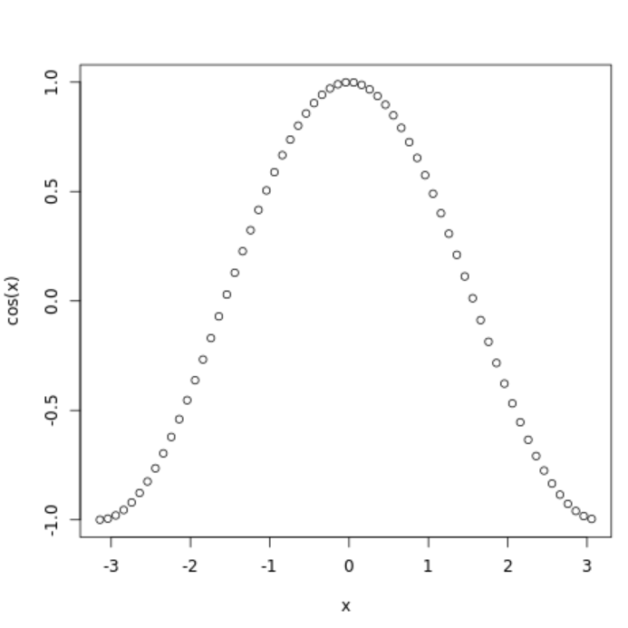
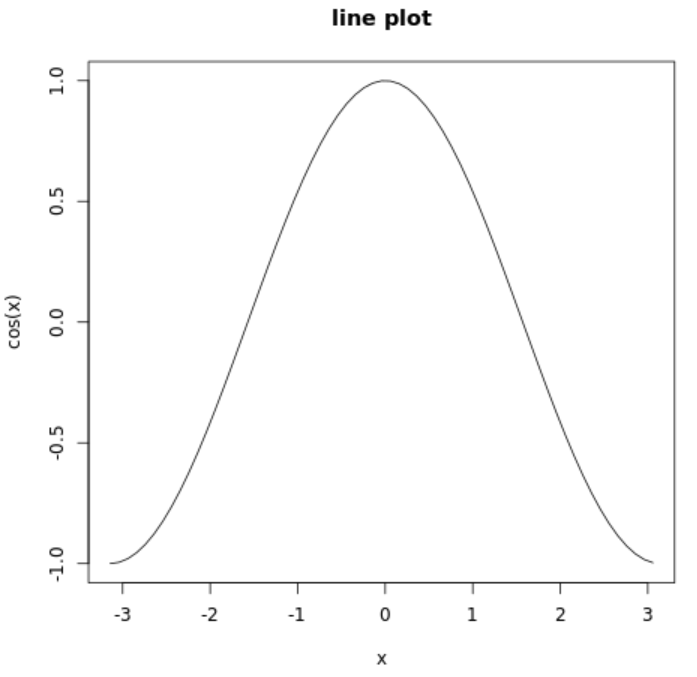
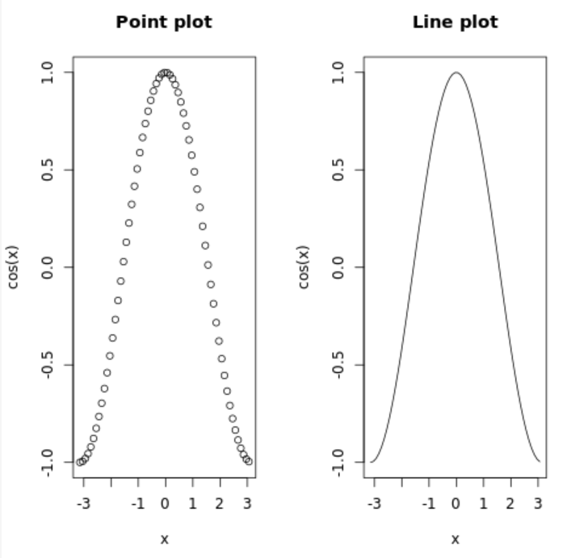

You can use the R compiler either in your own computer or in the site https://www.mycompiler.io/new/r

# 1. Learn to plot data

## 1.1 Use default **plot** function
Here is an example on plotting the **cos** curve. [what is cosine curve?](https://www.mathsisfun.com/algebra/trig-sin-cos-tan-graphs.html) 
```R
x <- seq(-pi, pi, 0.1)
plot(x, cos(x))
```

After running this code, you can get a figure like 



TODO:

- plot **sin** curve. 

- plot **tan** curve.

- change to **line** graph and get a figure like

  

- add title to the figure 

  

- try to plot both **cos** and **sin** with titles in the same layout and get a figure like 

  

